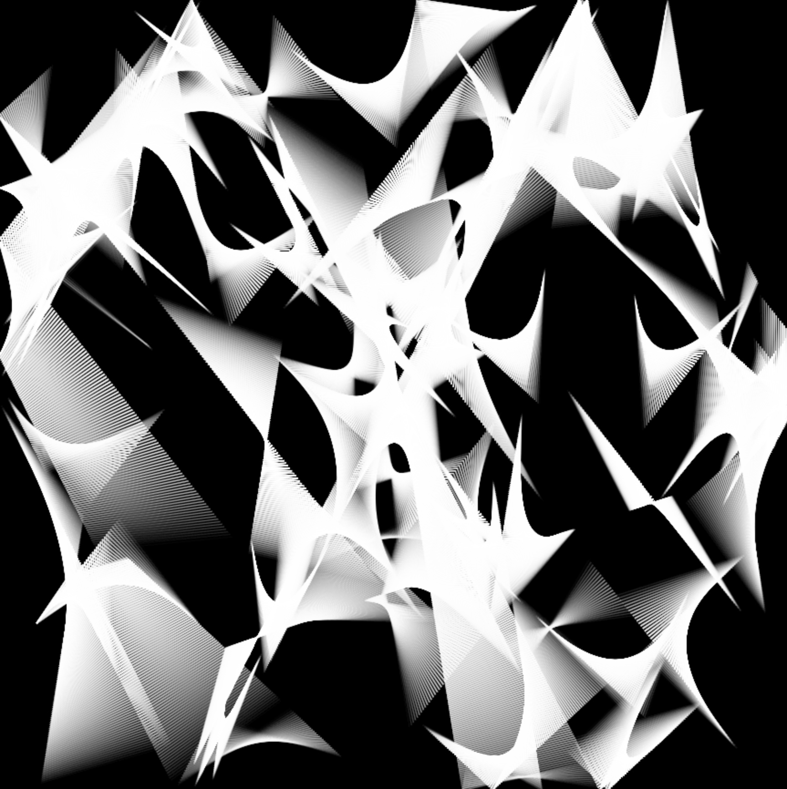
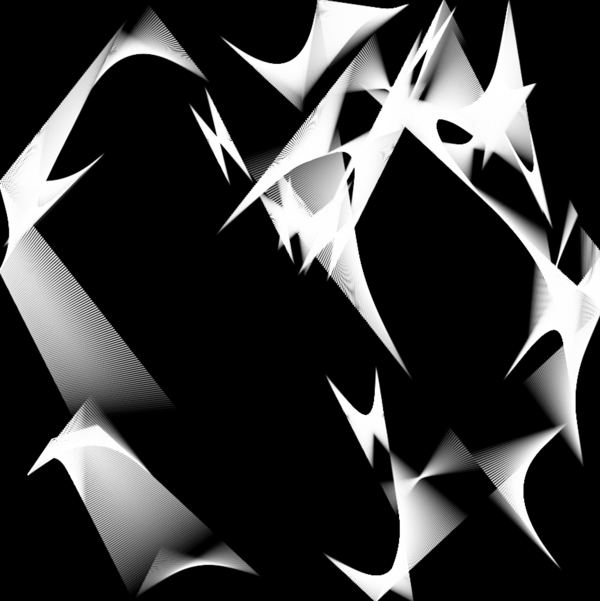

# Generative Art using Particles Systems

Five particles are emitted and simulated bouncing around the canvas. Once a particle enters within a predefined range of another particle, it will begin drawing lines, with opacity increasing and decreasing as the range increases and decreases. This creates some interesting generative art, using only simple particles.

